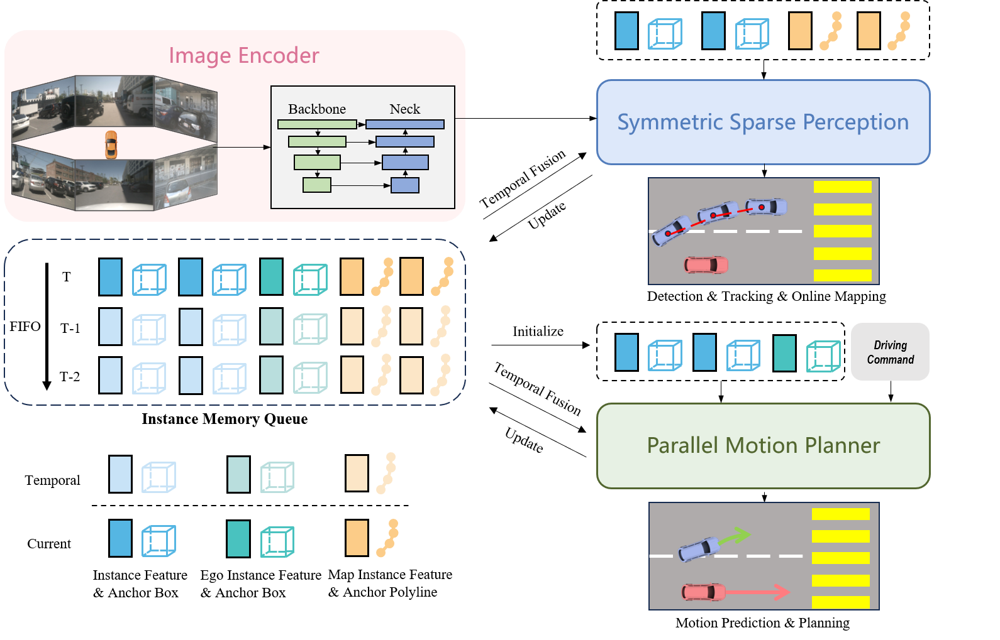
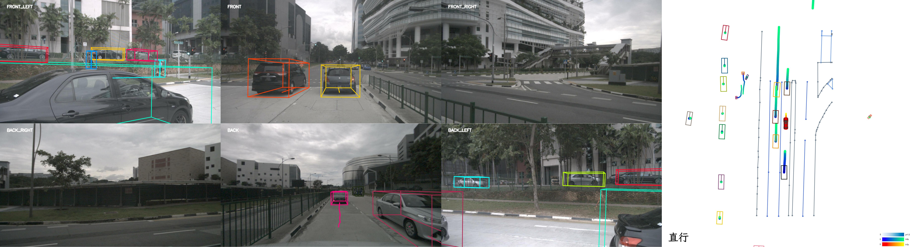
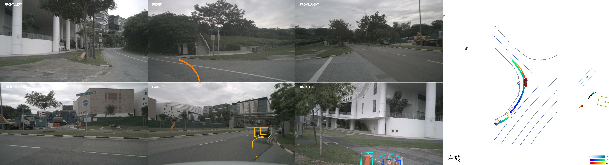
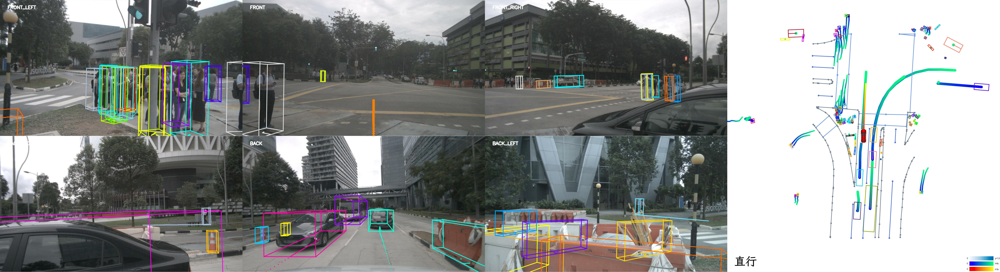
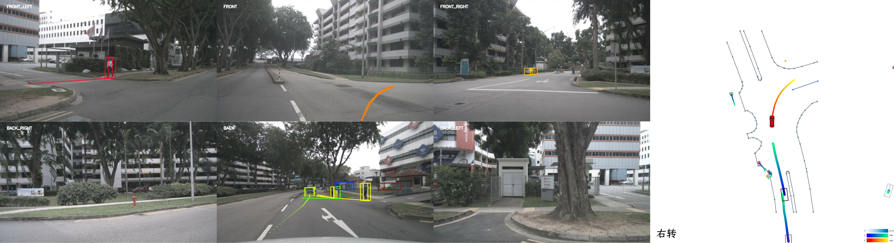
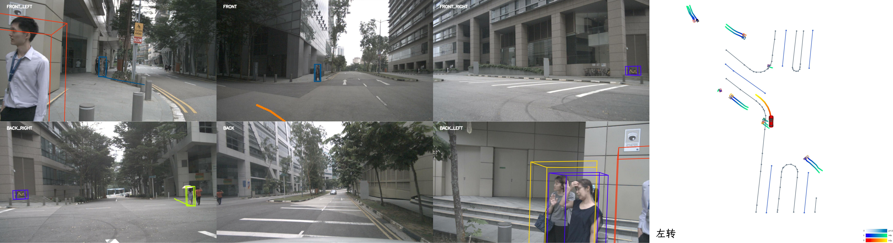

# SparseDrive-v: 基于视觉稀疏场景的端到端自动驾驶

克隆本项目：git clone https://github.com/liushuquan2022/SparseDrive-visualization.git

## 介绍
> SparseDrive 由对称稀疏感知模块和并行运动规划器组成，是一种以 Sparse 为中心的端到端自动驾驶范例。SparseDrive利用解耦的实例特征和几何锚点作为一个实例（动态道路智能体或静态地图元素）的完整表示，对称稀疏感知将检测、跟踪和在线地图任务与对称模型架构统一起来，实现完全稀疏的场景表示。在并行运动规划器中，首先从自我实例初始化模块获得语义和几何感知的自我实例。利用来自稀疏感知的自我实例和周围智能体实例，同时进行运动预测和规划，以获得所有道路智能体的多模态轨迹。为了确保规划的合理性和安全性，采用了结合碰撞感知重新评分模块的分层规划选择策略，从多模态轨迹提案中选择最终的安全规划轨迹。详情请参见作者的论文：[arXiv](https://arxiv.org/abs/2405.19620). 本文的主要贡献：
- 在 SparseDrive 项目基础上实现了目标检测、运动预测、路径规划、轨迹预测、可视化输出的一体化集成.
- 单GPU、小内存性能优化.
- 多视角观察可视化输出，图形文字的中文显示.

<center>
    
    <br>
    <div style="color:orange; border-bottom: 1px solid #d9d9d9;
    display: inline-block;
    color: #999;
    padding: 2px;"></div>
</center>
 
[下载 验证视频](demo/combine_gt.mp4)

### - 直行： 
<center>
    
    <br>
    <div style="color:orange; border-bottom: 1px solid #d9d9d9;
    display: inline-block;
    color: #999;
    padding: 2px;"></div>
</center>

### - 左转： 
<center>
    
    <br>
    <div style="color:orange; border-bottom: 1px solid #d9d9d9;
    display: inline-block;
    color: #999;
    padding: 2px;"></div>
</center>

### - 路口： 
<center>
    
    <br>
    <div style="color:orange; border-bottom: 1px solid #d9d9d9;
    display: inline-block;
    color: #999;
    padding: 2px;"></div>
</center>

### - 右转： 
<center>
    
    <br>
    <div style="color:orange; border-bottom: 1px solid #d9d9d9;
    display: inline-block;
    color: #999;
    padding: 2px;"></div>
</center>

### - 左转： 
<center>
    
    <br>
    <div style="color:orange; border-bottom: 1px solid #d9d9d9;
    display: inline-block;
    color: #999;
    padding: 2px;"></div>
</center>

## 性能：
| Model | config | ckpt | log | det: NDS | mapping: mAP | track: AMOTA |track: AMOTP | motion: EPA_car |motion: minADE_car| motion: minFDE_car | motion: MissRate_car | planning: CR | planning: L2 |
| :---: | :---: | :---: | :---: | :---: | :---:|:---:|:---: | :---: | :----: | :----: | :----: | :----: | :----: |
| Stage1 |[cfg](projects/configs/sparsedrive_small_stage1.py)|[ckpt](https://github.com/swc-17/SparseDrive/releases/download/v1.0/sparsedrive_stage1.pth)|[log](https://github.com/swc-17/SparseDrive/releases/download/v1.0/sparsedrive_stage1_log.txt)|0.5260|0.5689|0.385|1.260| | | | | | |
| Stage2 |[cfg](projects/configs/sparsedrive_small_stage2.py)|[ckpt](https://github.com/swc-17/SparseDrive/releases/download/v1.0/sparsedrive_stage2.pth)|[log](https://github.com/swc-17/SparseDrive/releases/download/v1.0/sparsedrive_stage2_log.txt)|0.5257|0.5656|0.372|1.248|0.492|0.61|0.95|0.133|0.097%|0.61|

## 规划：
| Method | L2 (m) 1s | L2 (m) 2s | L2 (m) 3s | L2 (m) Avg | Col. (%) 1s | Col. (%) 2s | Col. (%) 3s | Col. (%) Avg |
| :---: | :---: | :---: | :---: | :---: | :---: | :---: | :---: | :---: |
| UniAD | 0.45 | 0.70 | 1.04 | 0.73 | 0.66 | 0.66 | 0.72 | 0.68 |
| UniAD-wo-post-optim | 0.32 | 0.58 | 0.94 | 0.61 | 0.17 | 0.27 | 0.42 | 0.29 |
| VAD | 0.41 | 0.70 | 1.05 | 0.72 | 0.03 | 0.21 | 0.49 | 0.24 | 
| SparseDrive-S | 0.30 | 0.58 | 0.95 | 0.61 | 0.01 | 0.05 | 0.23 | 0.10 | 


## 开始
[环境安装及数据准备](install.md)

### 测试
#### - 目标检测
```bash
python ./tools/test.py projects/configs/sparsedrive_small_stage1.py ckpt/sparsedrive_stage1.pth --deterministic --eval bbox
python ./tools/test.py projects/configs/sparsedrive_small_stage1.py ckpt/sparsedrive_stage1.pth --deterministic --eval segm
```
#### - 运动预测+路径规划
```bash
python ./tools/test.py projects/configs/sparsedrive_small_stage2.py ckpt/sparsedrive_stage2.pth --deterministic --eval bbox
python ./tools/test.py projects/configs/sparsedrive_small_stage2.py ckpt/sparsedrive_stage2.pth --deterministic --eval segm
```
#### - 目标检测+运动预测+路径规划+可视化
```bash
python ./tools/test.py projects/configs/sparsedrive_small_stage2.py ckpt/sparsedrive_stage2.pth --deterministic --eval bbox --visual
python ./tools/test.py projects/configs/sparsedrive_small_stage2.py ckpt/sparsedrive_stage2.pth --deterministic --eval segm --visual
```
#### - 分析
```bash
python ./tools/test.py projects/configs/sparsedrive_small_stage1.py ckpt/sparsedrive_stage1.pth --deterministic --eval bbox --analysis
python ./tools/test.py projects/configs/sparsedrive_small_stage1.py ckpt/sparsedrive_stage1.pth --deterministic --eval segm --analysis

python ./tools/test.py projects/configs/sparsedrive_small_stage2.py ckpt/sparsedrive_stage2.pth --deterministic --eval bbox --analysis
python ./tools/test.py projects/configs/sparsedrive_small_stage2.py ckpt/sparsedrive_stage2.pth --deterministic --eval segm --analysis
```
#### - 只输出验证结果
```bash
python ./tools/test.py projects/configs/sparsedrive_small_stage1.py ckpt/sparsedrive_stage1.pth --deterministic --eval bbox --result_file ./work_dirs/results.pkl

python ./tools/test.py projects/configs/sparsedrive_small_stage2.py ckpt/sparsedrive_stage2.pth --deterministic --eval bbox --result_file ./work_dirs/results.pkl
```

### 单独可视化显示检测结果
```bash
python ./tools/visualization/visualize.py projects/configs/sparsedrive_small_stage1.py --result-path ./work_dirs/results.pkl

python ./tools/visualization/visualize.py projects/configs/sparsedrive_small_stage2.py --result-path ./work_dirs/results.pkl
```

## 引用
如果您发现 SparseDrive-v 对您的研究或应用有用，在下面的 BibTeX 条目中引用它。
```
@article{liu518 2024sparsedrive,
  title={SparseDrive: End-to-End Autonomous Driving via Sparse Scene Representation},
  author={liushuquan},
  year={2024}
}
```

## 本文参考如下项目，在此感谢
- [SparseDrive](https://github.com/swc-17/SparseDrive)
- [VAD](https://github.com/hustvl/VAD)
- [mmdet3d](https://github.com/open-mmlab/mmdetection3d)

